## Part 1. Готовый докер
#### 1.1. Возьми официальный докер-образ с nginx и выкачай его при помощи `docker pull`.

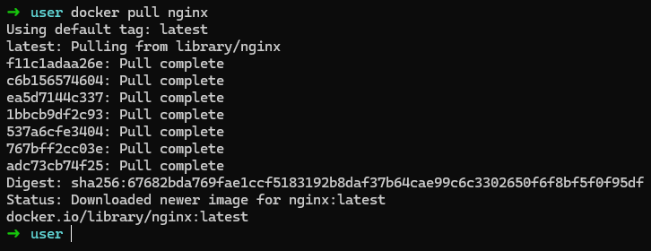

#### 1.2. Проверь наличие докер-образа через `docker images`.

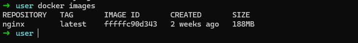

#### 1.3. Запусти докер-образ через `docker run -d [image_id|repository]`.

![docker run -d [image_id|repository]](images/3.png)

#### 1.4. Проверь, что образ запустился через `docker ps`.

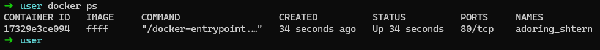

#### 1.5. Посмотри информацию о контейнере через `docker inspect [container_id|container_name]`.

![docker inspect [container_id|container_name]](images/5.png)

#### 1.6. По выводу команды определи и помести в отчёт размер контейнера, список замапленных портов и ip контейнера.

<b>Размер контейнера:</b> Информация о размере контейнера не содержится в выводе команды docker inspect. Обычно размер контейнера можно узнать с помощью команды `docker ps -s`, которая показывает размер занимаемого пространства на диске.

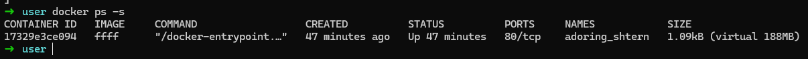

<b>Список замапленных портов:</b> В секции NetworkSettings вывода команды docker inspect можно найти информацию о замапленных портах. В данном случае видно, что порт 80/tcp контейнера не замаплен ни на какой порт хоста.

<b>IP-адрес контейнера:</b> В секции NetworkSettings также содержится информация об IP-адресе контейнера. Согласно выводу, IP-адрес контейнера - 172.17.0.2.

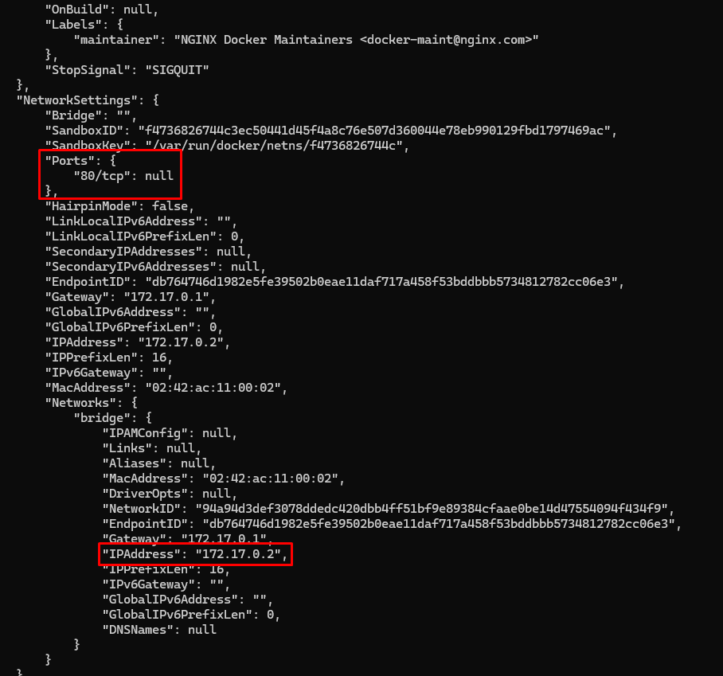

1. <b>Размер контейнера - 1.09kB (virtual 188MB)</b>

2. <b>Замапленные порты - "80/tcp": null</b>

3. <b>IP-адрес контейнера - 172.17.0.2.</b>

#### 1.7. Останови докер образ через `docker stop [container_id|container_name]`.

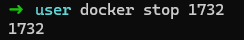

#### 1.8. Проверь, что образ остановился через `docker ps`.

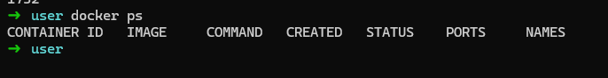

#### 1.9. Запусти докер с портами 80 и 443 в контейнере, замапленными на такие же порты на локальной машине, через команду run.

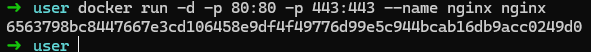

#### 1.10. Проверь, что в браузере по адресу `localhost:80` доступна стартовая страница nginx.

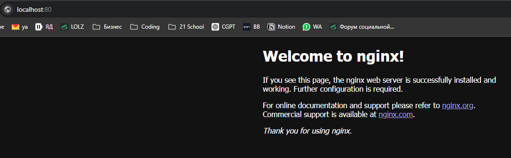

#### 1.11. Перезапусти докер контейнер через `docker restart [container_id|container_name]`.

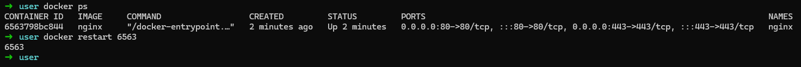

#### 1.12. Проверь любым способом, что контейнер запустился.

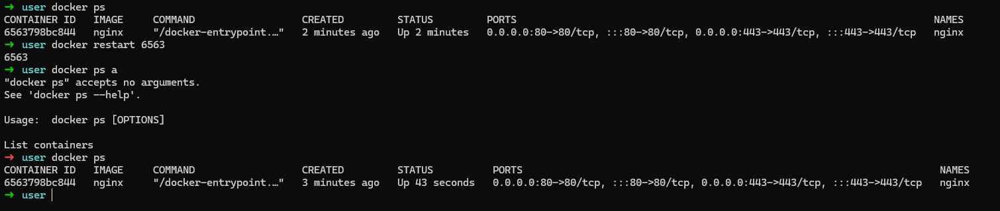
<hr>

## Part 2. Операции с контейнером
#### 2.1. Прочитай конфигурационный файл `nginx.conf` внутри докер контейнера через команду `exec`.

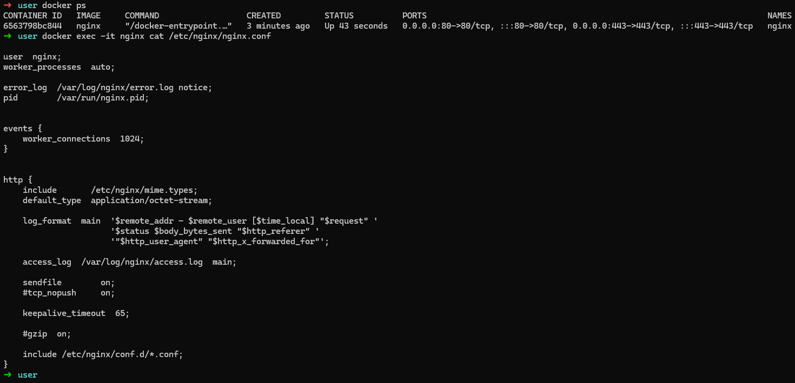

#### 2.2. Создай на локальной машине файл `nginx.conf`. Настрой в нем по пути `/status` отдачу страницы статуса сервера nginx.
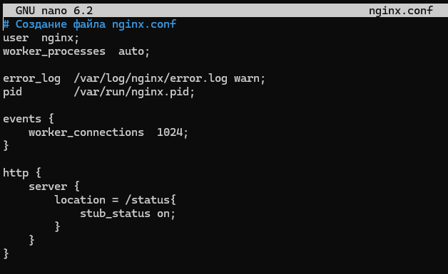

#### 2.3. Скопируй созданный файл nginx.conf внутрь докер-образа через команду `docker cp`.

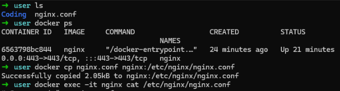

#### 2.4. Перезапусти nginx внутри докер-образа через команду `exec`.

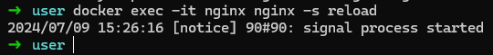

#### 2.5. Проверь, что по адресу `localhost:80/status` отдается страничка со статусом сервера nginx.

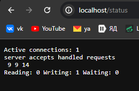

#### 2.6. Экспортируй контейнер в файл container.tar через команду export. Останови контейнер.

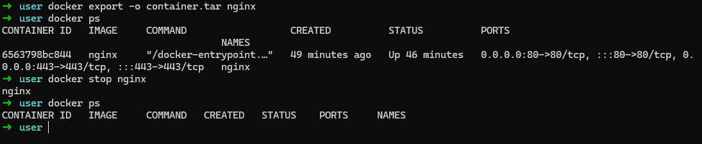

#### 2.7. Удали образ через `docker rmi [image_id|repository]`, не удаляя перед этим контейнеры. Удали остановленный контейнер.

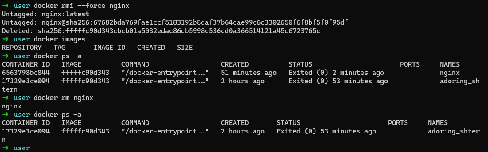

#### 2.8. Импортируй контейнер обратно через команду `import`. Запусти импортированный контейнер. Проверь, что по адресу `localhost:80/status` отдается страничка со статусом сервера nginx.

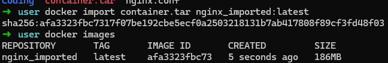
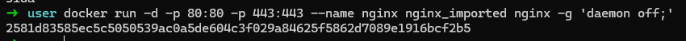
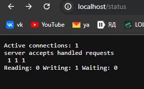
<hr>

## Part 3. Мини веб-сервер
#### 3.1. Мини-сервер на С и FastCGI, который возвращает страничку с надписью Hello World!:
``` 
main.c |
-------|
#include "fcgi_stdio.h"

int main() {
    while (FCGI_Accept() >= 0) {
        printf("Content-type: text/html\r\nStatus: 200 OK\r\n\r\nHello World!");
    }
    return 0;
}
```
#### 3.2. Файл nginx.conf , который будет проксировать все запросы с 81 порта на 127.0.0.1:8080
```
user nginx;
worker_processes auto;

error_log /var/log/nginx/error.log notice;
pid       /var/run/nginx.pid;


events {
    worker_connections 1024;
}


http {
    server {
        listen 81;

        location = / {
            fastcgi_pass 127.0.0.1:8080;
        }

        location = /status {
            stub_status on;
        }
    }
}
```
#### 3.3. Снова пулим Nginx и запускаем
Пулим `docker pull nginx`
Запускаем `docker run --rm -d -p 81:81 --name nginx-cont nginx`
Проваливаемся в Debian `docker exec -it nginx-cont bash`
Выполняем команды:
`apt update`
`apt upgrade -y`
`apt install -y gcc spawn-fcgi libfcgi-dev`
`exit`

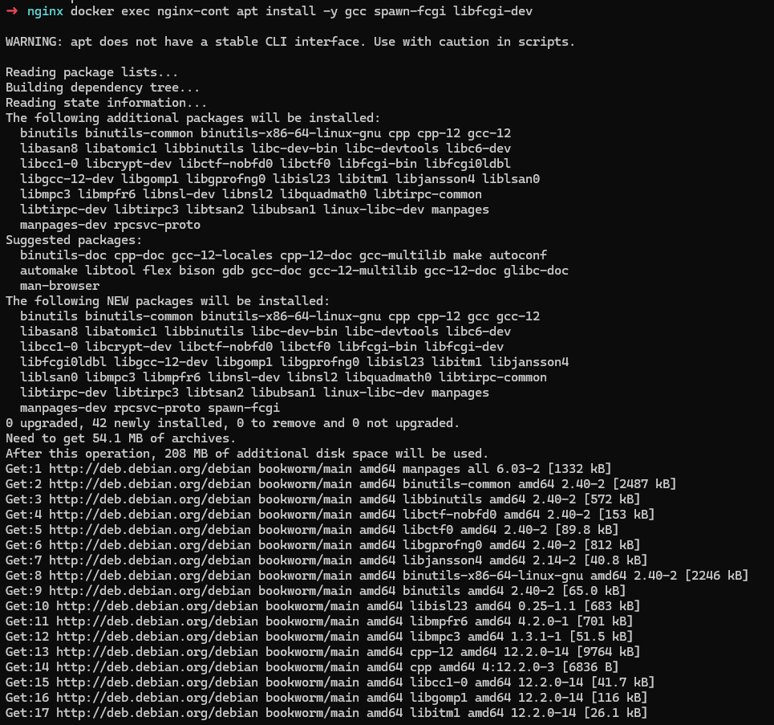

Копируем файлы для докера:
`docker cp nginx.conf nginx-cont:/etc/nginx/`
`docker cp main.c nginx-cont:/`
`docker exec nginx-cont gcc ./main.c -l fcgi -o fcgi_server`
`docker exec nginx-cont spawn-fcgi -p 8080 fcgi_server`
`docker exec nginx-cont nginx -s reload`

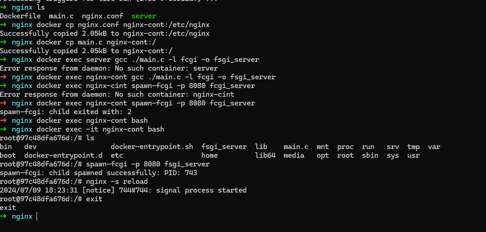

Проверяем `localhost:81`

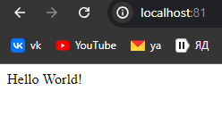

<hr>

## Part 4. Свой докер
#### 4.1. Создадим Dockerfile и напишем скрипты
Dockerfile:
```
FROM nginx

WORKDIR /home/
COPY ./main.c .
COPY ./start_server.sh .
COPY ./nginx.conf /etc/nginx/nginx.conf
RUN apt-get update && apt-get install -y gcc spawn-fcgi libfcgi-dev

ENTRYPOINT ["bash", "./start_server.sh"]
```
Скрипт для компиляции и поднятия:
start_server.sh
```
#!/usr/bin/env bash


gcc ./main.c -l fcgi -o ./fcgi_server
spawn-fcgi -p 8080 ./fcgi_server
nginx -g 'daemon off;'
nginx -s reload
```
Скрипт для запуска сервера:
launch_for_test.sh
```
#!/usr/bin/env bash


docker build . -t server:v2

docker images

docker run --rm -d -p 80:81 --name server2 server:v2

printf "The sever is up. Press <Enter> to stop it.\n"
read -p "Time to stop? " -r

docker stop server2
```
Команда для запуска - `sh launch_for_test.sh`
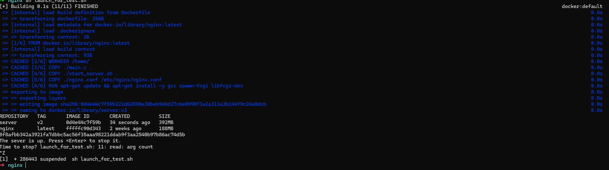
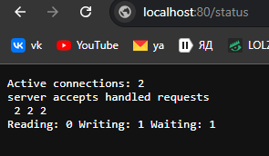

<hr>

## Part 5. Dockle
#### Шаги для установки Dockle на Ubuntu
1. Загрузите правильный .deb файл:
```
# Получить последнюю версию Dockle
VERSION=$(curl --silent "https://api.github.com/repos/goodwithtech/dockle/releases/latest" | grep '"tag_name":' | sed -E 's/.*"v([^"]+)".*/\1/')

# Загрузить .deb файл
curl -L -o dockle_${VERSION}_Linux-64bit.deb "https://github.com/goodwithtech/dockle/releases/download/v${VERSION}/dockle_${VERSION}_Linux-64bit.deb"
```
2. Установите Dockle:
```
sudo dpkg -i dockle_${VERSION}_Linux-64bit.deb
```
3. Проверьте установку:
```
dockle --version
```

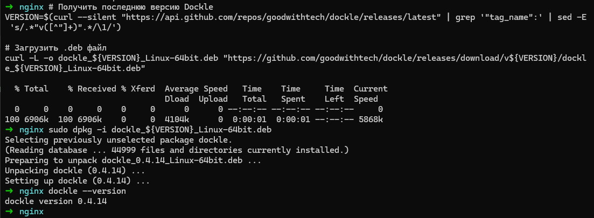
#### Проверка

Ребилдим образ v3 с помощью `launch_5_part.sh` в котором есть проверка dockle
`sh launch_5_part.sh`
launch_5_part.sh:
```
#!/usr/bin/env bash


export DOCKER_CONTENT_TRUST=1

docker build . -t server:v3 --load

printf "Dockle judges the server:v3 image.\n"
dockle -ae pem -ae ask server:v3
printf "Status code = %d.\n" "$?"
export DOCKER_CONTENT_TRUST=0

docker run --rm -it -d -p 80:81 --name server3 server:v3

printf "The sever is up. Press <Enter> to stop it.\n"
read -p "Time to stop? " -r

docker stop server3
```

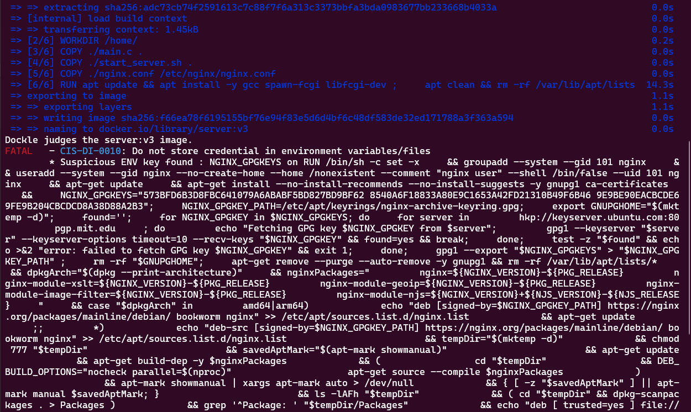

Вносим изменения в докер файл и снова ребилдим

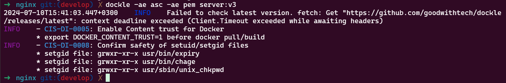

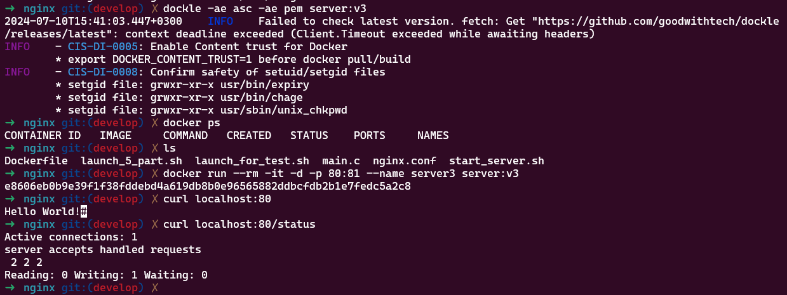

## Part 6. Базовый Docker Compose

1. Установим docker compose
`sudo apt install docker-compose`

2. docker-compose.yml
```
version: "3.9"

services:
  mini_serv:
    image: server:v4
    build: ../nginx
    container_name: server4

  nginxer:
    image: nginx:latest
    container_name: nginxer
    ports:
      - 80:8080
    volumes:
      - ./nginx.conf:/etc/nginx/nginx.conf
```
3. nginx.conf
```
user  nginx;
worker_processes  auto;

error_log  /var/log/nginx/error.log notice;
pid        /var/run/nginx.pid;


events {
    worker_connections  1024;
}


http {
    include       /etc/nginx/mime.types;
    default_type  application/octet-stream;

    log_format  main  '$remote_addr - $remote_user [$time_local] "$request" '
                      '$status $body_bytes_sent "$http_referer" '
                      '"$http_user_agent" "$http_x_forwarded_for"';

    access_log  /var/log/nginx/access.log  main;

    sendfile        on;
    #tcp_nopush     on;

    keepalive_timeout  65;

    #gzip  on;

    #include /etc/nginx/conf.d/*.conf;  # this is commented (!)

    server {
        listen 8080;
        location / {
            proxy_pass http://server4:81;
        }
        location /status {
            stub_status on;
        }
    }
}
```
4. Запускаем контейнеры, находясь в папке ../part6
`docker-compose up --build`

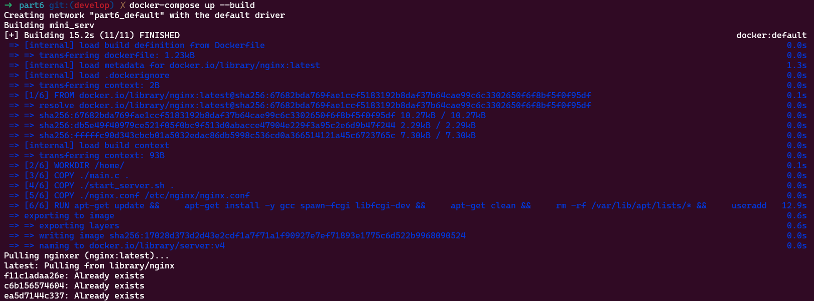

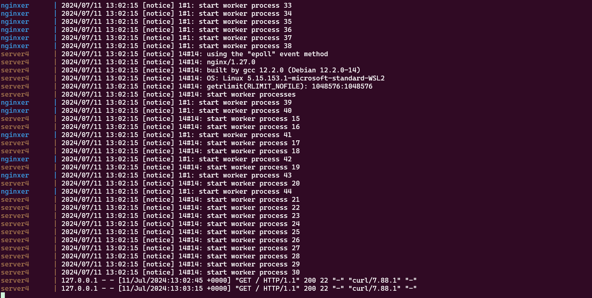

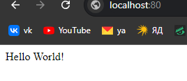

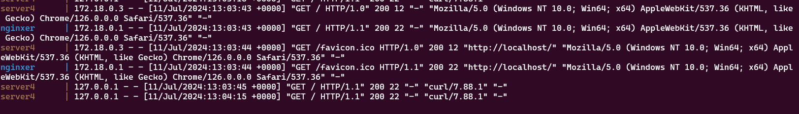